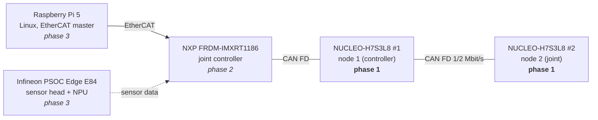

# robot-joint-stack

Firmware for a small, multi-vendor robot joint network: **FreeRTOS nodes that talk CAN FD**, with a
chip-independent protocol and application layer, a safety-oriented joint model, and host-side unit tests.

It is built step by step toward the architecture used in industrial and collaborative robots:
a Linux "brain" talks **EtherCAT** to a joint controller, which drives smaller modules over **CAN FD**.



> **Status:** phase 1 firmware builds and passes all host tests in CI. First bring-up on two
> NUCLEO-H7S3L8 boards is in progress, see [docs/bring-up.md](docs/bring-up.md).

## What this project demonstrates

| Topic | Where |
|---|---|
| RTOS design: task priorities, queues, ISR-to-task hand-off, no shared-data races | [`app/joint_node/app.c`](app/joint_node/app.c) |
| CAN FD driver on STM32 FDCAN: bit timing, bit rate switching, TX delay compensation, bus-off recovery | [`boards/nucleo_h7s3l8/src/hal_can_fdcan.c`](boards/nucleo_h7s3l8/src/hal_can_fdcan.c) |
| Vendor-independent HAL: the app only sees `board.h` + `hal_can.h` (STM32 port done, NXP/Infineon ports planned) | [`common/hal/include/rjs/hal_can.h`](common/hal/include/rjs/hal_can.h), [`app/joint_node/board.h`](app/joint_node/board.h) |
| Communication protocol: priority-ordered IDs, explicit little-endian encoding, input validation | [`common/protocol`](common/protocol), [docs/protocol.md](docs/protocol.md) |
| Node supervision: heartbeat timeout, reboot detection, timer wrap-around safe | [`common/node`](common/node) |
| Joint safety behaviour: velocity/acceleration limits, soft limits, command timeout | [`common/joint`](common/joint) |
| Board bring-up: clocks (HSE, PLLs), MPU, caches, fault handler with PC/LR dump | [`boards/nucleo_h7s3l8/src`](boards/nucleo_h7s3l8/src) |
| Testing: host unit tests with ASan/UBSan, C/Python wire-format cross-check, CI | [`tests`](tests), [`.github/workflows/ci.yml`](.github/workflows/ci.yml) |
| Measurement: control loop jitter from the cycle counter, debug pin for the logic analyzer | [docs/measurements.md](docs/measurements.md) |
| Display driver: ST7789 TFT over SPI with DMA, cache maintenance, redraw of changed characters only | [`boards/nucleo_h7s3l8/src/display_st7789.c`](boards/nucleo_h7s3l8/src/display_st7789.c), [`common/ui`](common/ui) |

## How phase 1 works

Two NUCLEO-H7S3L8 boards (STM32H7S3, Cortex-M7 at 600 MHz) share a CAN FD bus at 1 Mbit/s
arbitration / 2 Mbit/s data rate.

- **Node 1 (controller)** broadcasts a position COMMAND every 100 ms: a sweep between +90° and −90°.
- **Every node** runs a simulated joint at 1 kHz, publishes JOINT_STATE at 100 Hz and a HEARTBEAT at 10 Hz,
  and supervises all other nodes (a node is LOST after 350 ms without heartbeat).
- **Safety:** press the user button on node 1 to stop the commands. Every joint disables itself
  500 ms after its last command and brakes to standstill, like a real drive when its controller disappears.

FreeRTOS task layout:

| Task | Prio | Rate | Job |
|---|---|---|---|
| `control` | 5 | 1 kHz | joint model step, JOINT_STATE, loop jitter measurement, debug pin toggle |
| `can_rx` | 4 | event | decode frames (queued by the FDCAN interrupt), node supervision |
| `comms` | 3 | 10 Hz | HEARTBEAT, controller: COMMAND + user button |
| `stats` | 2 | 1 Hz | one status line on the UART |
| `log` | 1 | event | UART output, never blocks the callers |

Ownership rules instead of locks: only `control` touches the joint model (commands arrive through a queue),
only `can_rx` touches the node monitor, everything else reads snapshots copied in a short critical section.
The only mutex protects the CAN TX FIFO.

## Repository layout

```
common/            chip-independent C11 libraries (compile for the PC and every MCU)
  hal/             rjs_can_* interface + bit timing calculator
  protocol/        CAN FD message encode/decode
  node/            heartbeat supervision
  joint/           joint model with safety limits
  ui/              character screen for the TFT (only changed cells are redrawn) + 8x16 font
app/joint_node/    FreeRTOS application, uses only board.h + hal_can.h
boards/
  nucleo_h7s3l8/   STM32H7S3L8 port: clocks, FDCAN driver, UART, interrupts, FreeRTOS config
tests/             host unit tests (CTest)
tools/             Python decoder for candump logs (Raspberry Pi / PC)
docs/              protocol, bring-up log, measurements
scripts/           dependency fetch script (pinned versions)
```

## Build

Requirements: CMake ≥ 3.22, Ninja, a host C compiler, `arm-none-eabi-gcc` (GNU Arm toolchain), Python 3.

```bash
./scripts/fetch_deps.sh                 # FreeRTOS V11.1.0, ST HAL v1.2.1, CMSIS 5.9.0 into third_party/

cmake --preset host-tests && cmake --build --preset host-tests && ctest --preset host-tests

cmake --preset h7s3l8-node1 && cmake --build --preset h7s3l8-node1
cmake --preset h7s3l8-node2 && cmake --build --preset h7s3l8-node2

# optional: node 1 with the 2.0" ST7789 status display (see docs/display.md)
cmake --preset h7s3l8-node1-display && cmake --build --preset h7s3l8-node1-display
```

Current size (node 1, `-O2`): **35 KB flash of 64 KB internal flash, 50 KB RAM** (48 KB of it is the FreeRTOS heap);
47 KB flash with the display build.

## Flash and run

```bash
STM32_Programmer_CLI -c port=SWD -w build/h7s3l8-node1/boards/nucleo_h7s3l8/rjs_h7s3l8_node1.hex -v -rst
```

Open the ST-LINK virtual COM port at 115200 baud. Expected output on node 1
(illustrative, replace with a real log after bring-up):

```
robot-joint-stack 0.1.0 on NUCLEO-H7S3L8, node 1 (controller)
CAN FD 1 Mbit/s nominal, 2 Mbit/s data (BRS)
[bus] node 2 joined (fw 0.1.0)
[node 1] up 5s | peers 1 | pos 63.4 deg vel 90 deg/s | tx 612 rx 560 drop 0/0 | tec 0 rec 0 | jitter <n> us
```

Wiring: see [docs/bring-up.md](docs/bring-up.md#wiring).

## Roadmap

- [x] **Phase 1a:** protocol, supervision, joint model, host tests, CI
- [x] **Phase 1b:** FreeRTOS + FDCAN port for NUCLEO-H7S3L8, builds for node 1 and node 2
- [x] **Phase 1d:** optional ST7789 TFT status display (SPI + DMA), off by default
- [ ] **Phase 1c:** hardware bring-up on two boards, first measurements
- [ ] **Phase 2:** port to NXP FRDM-IMXRT1186 (FlexCAN) as joint controller: same `app/`, new `boards/frdm_imxrt1186`
- [ ] **Phase 3:** Raspberry Pi 5 as EtherCAT master (SOEM) ↔ RT1186; PSOC Edge E84 sensor head
- [ ] **Phase 4:** bootloader with two firmware slots and rollback; firmware update over CAN
- [ ] Optional: Infineon XMC7100 / NXP MCXN947 as extra CAN FD nodes, Zephyr port, real motor on the RT1186

## License

MIT, see [LICENSE](LICENSE). Third-party code is fetched at build time, see [THIRD_PARTY_NOTICES.md](THIRD_PARTY_NOTICES.md).

Author: Dr.-Ing. Sarah Ouerghemmi · [portfolio](https://sarahwer.github.io/portfolio/)
